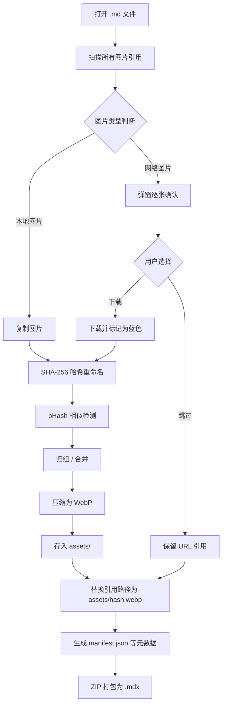
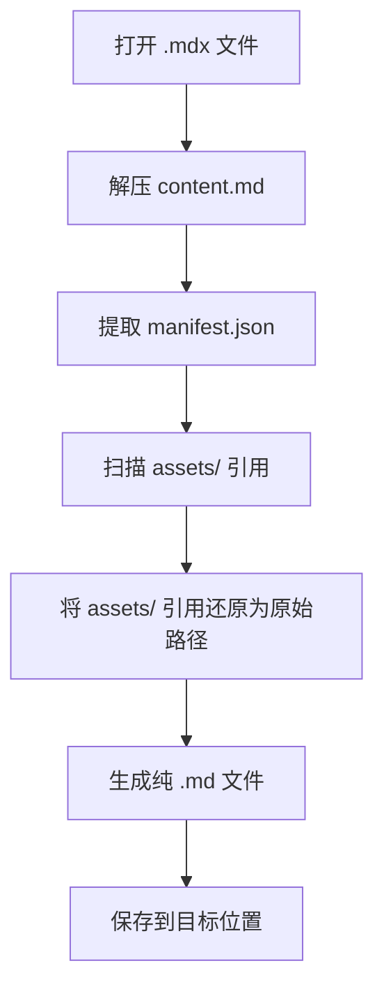

# MDX File Format Specification v1.0

> Tec Markdown 编辑器专用包装格式
>
> 文档版本：1.0.0
> 最后更新：2026-05-31
> 状态：**Draft**

---

## 1. Introduction

### 1.1 Purpose

MDX 是一种基于 ZIP 容器的文档包装格式，旨在将 Markdown 正文及其依赖的外部资源封装为单一文件，解决传统 Markdown 文档分享时图片丢失、主题不一致、依赖散落等问题，实现「分享即开即用」的体验。

### 1.2 Design Goals

| Goal | Description |
|------|-------------|
| **自包含** | 单文件包含正文、图片、主题、颜色映射等所有资源 |
| **高性能** | 不解压到磁盘，按需读取，增量保存 |
| **可扩展** | 通过 `plugin_data` 和 `meta.json` 支持未来扩展 |
| **兼容性** | 可无损转换回纯 Markdown 格式 |

### 1.3 Scope

本规范定义 MDX v1.0 的容器结构、entry 格式、元数据 Schema、扩展语法标准及处理流程。实现者应遵循本规范以确保文件互操作性。

### 1.4 Conformance

本文中的关键词「必须（MUST）」、「不得（MUST NOT）」、「应该（SHOULD）」、「不应该（SHOULD NOT）」、「可以（MAY）」按照 RFC 2119 解释。

---

## 2. File Container

### 2.1 Container Format

MDX 文件使用 ZIP 归档格式作为容器。

| Field | Value | Rationale |
|-------|-------|-----------|
| 容器 | ZIP 归档 | 广泛支持，标准库丰富 |
| 压缩方式 | **Store**（仅存储，不压缩） | 图片/资源已是压缩格式，二次压缩无收益；Store 模式支持高效的随机访问 |
| 文件扩展名 | `.mdx` | |
| MIME Type | `application/vnd.tec.mdx` | 可使用 `application/zip` 作为 fallback |
| 最大文件大小 | 无硬限制（建议单文件不超过 500MB） | |

### 2.2 ZIP 规范

实现者必须遵循以下 ZIP 规范：

- **Central Directory**：必须位于归档末尾（标准 ZIP 格式）
- **Entry 名称编码**：必须使用 UTF-8（`general purpose bit 11` 必须置位）
- **Entry 顺序**：建议按本节定义顺序写入，但不强制
- **CRC-32**：每个 entry 必须包含有效的 CRC-32 校验值
- **Data Descriptor**：不支持（不得延迟写入 CRC-32）

### 2.3 Entry Order

推荐归档内的 entry 顺序如下：

```
document.mdx (ZIP, Store)
├── content.md                    # 正文内容
├── assets/                       # 资源目录
│   ├── a1b2c3d4.webp             # 图片文件，hash 命名
│   ├── e5f6g7h8.webp
│   ├── 9a0b1c2d.png
│   └── manifest.json             # 图片元数据
├── theme.json                    # 主题配置
├── color_map.json                # 颜色映射表
└── meta.json                     # 文档元数据
```

所有 entry 的名称**必须区分大小写**，推荐使用小写字母、数字和连字符命名。目录分隔符统一使用正斜杠（`/`）。

### 2.4 文件大小限制

| 项目 | 推荐上限 | 硬限制 |
|------|----------|--------|
| `content.md` | 10 MB | 50 MB |
| 单张图片 | 20 MB | 100 MB |
| `manifest.json` | 1 MB | 5 MB |
| `meta.json` | 64 KB | 256 KB |
| 总文件大小 | 500 MB | 2 GB |

超出推荐上限可能影响编辑器性能，超出硬限制可能导致解析失败。

---

## 3. Entry Specification

### 3.1 `content.md`

| Field | Requirement |
|-------|-------------|
| 存在性 | **必需（MUST）** |
| 编码 | UTF-8（无 BOM） |
| 换行符 | LF（`\n`） |
| 文件末尾 | 必须以一个空行结尾 |

#### 3.1.1 图片引用规范

正文中所有图片引用必须使用相对路径，指向 `assets/` 目录：

```markdown

```

**禁止**以下引用方式：

- ❌ 绝对路径：``
- ❌ 网络 URL：``
- ❌ 相对路径跳出：``

#### 3.1.2 Markdown 子集

`content.md` 必须使用标准 CommonMark 语法，并额外支持本规范第 6 章定义的扩展语法。

### 3.2 `assets/` Directory

`assets/` 目录存放文档引用的所有资源文件及其元数据索引。

#### 3.2.1 资源命名规则

```
{hash_8chars}.{format_extension}
```

| 组件 | 描述 |
|------|------|
| `hash_8chars` | SHA-256 完整哈希值的前 8 位十六进制字符 |
| `format_extension` | `webp`、`png`、`jpg`、`jpeg`、`gif`、`svg` 之一 |

**示例**：`a1b2c3d4.webp`、`e5f6g7h8.png`

#### 3.2.2 支持的图片格式

| 格式 | 支持等级 | 说明 |
|------|----------|------|
| WebP | **推荐** | 默认入库压缩格式，兼具高压缩比和良好画质 |
| PNG | 兼容 | 仅当用户关闭压缩或保留原格式时 |
| JPEG | 兼容 | 同上 |
| GIF | 兼容 | 动画 GIF 保持原格式，不压缩 |
| SVG | 兼容 | 矢量格式，不压缩 |
| BMP | 不建议 | 导入时会自动转换为 WebP |
| TIFF | 不建议 | 导入时会自动转换为 WebP |

#### 3.2.3 `manifest.json`

```json
{
  "version": "1.0",
  "assets": {
    "a1b2c3d4": {
      "original_name": "photo.jpg",
      "hash": "a1b2c3d4e5f678901234567890abcdef0123456789abcdef01234567890abcdef",
      "hash_algorithm": "sha256",
      "similar_group": "grp_01",
      "is_primary": true,
      "mtime": "2026-05-29T10:00:00Z",
      "compressed": true,
      "original_format": "jpeg",
      "width": 1920,
      "height": 1080,
      "file_size": 42500,
      "tags": ["screenshot", "ui"]
    }
  }
}
```

**字段规范**：

| Field | Type | Required | Default | Description |
|-------|------|----------|---------|-------------|
| `version` | string | **yes** | — | manifest 格式版本，当前为 `"1.0"` |
| `assets` | object | **yes** | — | 键为 8 位 hash，值为 asset 元数据对象 |
| `original_name` | string | **yes** | — | 导入时的原始文件名（含扩展名） |
| `hash` | string | **yes** | — | 文件的完整 SHA-256 十六进制哈希值（64 字符） |
| `hash_algorithm` | string | **yes** | — | 哈希算法名称，当前为 `"sha256"` |
| `similar_group` | string | no | `null` | 相似图片组 ID，格式为 `"grp_{nn}"` |
| `is_primary` | boolean | no | `true` | 是否为主图（组内默认引用对象） |
| `mtime` | string (ISO 8601) | **yes** | — | 资源最后修改时间 |
| `compressed` | boolean | **yes** | — | 是否已压缩，`true` 表示已转为 WebP |
| `original_format` | string | no | `null` | 原始图片格式（如 `"jpeg"`、`"png"`） |
| `width` | integer | no | `null` | 图片宽度（像素），应在入库时记录 |
| `height` | integer | no | `null` | 图片高度（像素） |
| `file_size` | integer | no | `null` | 压缩后文件大小（字节） |
| `tags` | string[] | no | `[]` | 用户自定义标签，用于图片库搜索 |

> **注意**：当 `compressed` 为 `true` 时，`original_format` 记录了压缩前格式；当为 `false` 时，`original_format` 应与当前格式一致。

### 3.3 `theme.json`

控制文档渲染时的视觉主题。

```json
{
  "theme": "tec-light",
  "type": "builtin",
  "custom_css": null,
  "font_scale": 1.0,
  "content_width": 860
}
```

**字段规范**：

| Field | Type | Required | Default | Description |
|-------|------|----------|---------|-------------|
| `theme` | string | **yes** | `"tec-light"` | 主题标识符。内置主题使用小写连字符命名 |
| `type` | string | **yes** | `"builtin"` | 主题类型：`"builtin"` / `"custom"` |
| `custom_css` | string | no | `null` | 自定义主题 CSS 内容（`type` 为 `"custom"` 时**必须**提供） |
| `font_scale` | number | no | `1.0` | 字体缩放比例，范围 `[0.5, 2.0]` |
| `content_width` | integer | no | `860` | 内容区最大宽度（像素） |

**内置主题列表**：

| 标识符 | 名称 | 类型 |
|--------|------|------|
| `tec-light` | Tec Light | 浅色（品牌默认） |
| `tec-dark` | Tec Dark | 深色（品牌） |
| `github` | GitHub | 浅色 |
| `newsprint` | Newsprint | 浅色 |
| `night` | Night | 深色 |
| `pixyll` | Pixyll | 浅色 |
| `whitey` | Whitey | 浅色 |
| `gothic` | Gothic | 深色 |

### 3.4 `color_map.json`

定义有色文字扩展语法中使用的颜色映射。

```json
{
  "version": "1.0",
  "colors": {
    "R": "#E74C3C",
    "G": "#2ECC71",
    "B": "#3498DB",
    "O": "#E67E22",
    "P": "#9B59B6",
    "Y": "#F1C40F",
    "C": "#1ABC9C",
    "K": "#2C3E50",
    "W": "#95A5A6",
    "H": "#E91E63"
  },
  "custom_colors": {
    "brand": "#6C5CE7",
    "accent": "#00B894",
    "warning": "#F39C12"
  }
}
```

**字段规范**：

| Field | Type | Required | Description |
|-------|------|----------|-------------|
| `version` | string | **yes** | 颜色映射版本，当前为 `"1.0"` |
| `colors` | object | **yes** | 预定义颜色映射。键为单大写字母，值为 7 字符十六进制（`#RRGGBB`） |
| `custom_colors` | object | no | 自定义颜色映射。键为字母数字标识符（长度 1-32），值为 7 或 9 字符十六进制（`#RRGGBB` 或 `#RRGGBBAA`） |

**预定义颜色表**：

| 键 | 色值 | 颜色名称 | CSS 变量 |
|----|------|----------|----------|
| R | `#E74C3C` | 红色 | `--tec-color-R` |
| G | `#2ECC71` | 绿色 | `--tec-color-G` |
| B | `#3498DB` | 蓝色 | `--tec-color-B` |
| O | `#E67E22` | 橙色 | `--tec-color-O` |
| P | `#9B59B6` | 紫色 | `--tec-color-P` |
| Y | `#F1C40F` | 黄色 | `--tec-color-Y` |
| C | `#1ABC9C` | 青色 | `--tec-color-C` |
| K | `#2C3E50` | 黑色 | `--tec-color-K` |
| W | `#95A5A6` | 灰色 | `--tec-color-W` |
| H | `#E91E63` | 粉色 | `--tec-color-H` |

> 自定义颜色的键名应在 1-32 个字符之间，仅包含字母、数字和下划线。
> 色值必须使用十六进制格式，不支持 `rgb()`、`hsl()` 等函数表示法。

### 3.5 `meta.json`

记录文档的元数据信息。

```json
{
  "version": "1.0",
  "created": "2026-05-29T10:00:00Z",
  "modified": "2026-05-29T11:30:00Z",
  "title": "文档标题",
  "author": "Tec User",
  "description": "这是一份示例文档",
  "syntax_extensions": [
    "colored-text",
    "columns",
    "align",
    "latex",
    "highlight",
    "superscript",
    "subscript",
    "footnote",
    "emoji",
    "toc",
    "task-list"
  ],
  "statistics": {
    "characters": 1234,
    "words": 200,
    "images": 3,
    "headings": 5,
    "paragraphs": 15,
    "code_blocks": 2,
    "tables": 1
  },
  "plugin_data": {},
  "editor_version": "0.0.0",
  "export_history": [
    {
      "format": "pdf",
      "timestamp": "2026-05-29T12:00:00Z",
      "success": true
    }
  ]
}
```

**字段规范**：

| Field | Type | Required | Default | Description |
|-------|------|----------|---------|-------------|
| `version` | string | **yes** | — | MDX 格式版本号，当前为 `"1.0"` |
| `created` | string (ISO 8601) | **yes** | — | 文档创建时间戳 |
| `modified` | string (ISO 8601) | **yes** | — | 文档最后修改时间戳 |
| `title` | string | no | `null` | 文档标题（可从前言或首标题自动提取） |
| `author` | string | no | `null` | 文档作者 |
| `description` | string | no | `null` | 文档摘要或描述 |
| `syntax_extensions` | string[] | **yes** | `[]` | 启用的扩展语法列表（见 [4. 扩展语法参考]） |
| `statistics` | object | no | `null` | 文档统计信息 |
| `statistics.characters` | integer | no | `null` | 字符数（不计空格） |
| `statistics.words` | integer | no | `null` | 单词/词数 |
| `statistics.images` | integer | no | `null` | 嵌入图片数量 |
| `statistics.headings` | integer | no | `null` | 标题数量（H1-H6） |
| `statistics.paragraphs` | integer | no | `null` | 段落数 |
| `statistics.code_blocks` | integer | no | `null` | 代码块数量 |
| `statistics.tables` | integer | no | `null` | 表格数量 |
| `plugin_data` | object | no | `{}` | 插件存储的自定义数据 |
| `editor_version` | string | no | `null` | 创建/最后编辑本文档的编辑器版本 |
| `export_history` | array | no | `[]` | 导出历史记录 |

**syntax_extensions 标识符完整列表**：

| 标识符 | 语法扩展 | 依赖 |
|--------|----------|------|
| `colored-text` | 有色文字 `&R文本&R` | `color_map.json` |
| `columns` | 分栏 `\|\|N ... \|\|\|` | 无 |
| `align` | 文字对齐 `===` / `>>>` / `<<<` | 无 |
| `latex` | LaTeX 公式 `$$` / `$` | KaTeX |
| `highlight` | 高亮标记 `==text==` | 无 |
| `superscript` | 上标 `^text^` | 无 |
| `subscript` | 下标 `~text~` | 无 |
| `footnote` | 脚注 `[^1]` | 无 |
| `emoji` | 表情符号 `:smile:` | 无 |
| `toc` | 目录 `[TOC]` | 无 |
| `task-list` | 任务列表 `- [ ]` | 无 |

---

## 4. 扩展语法参考

### 4.1 有色文字（Colored Text）

```
语法: &X文本内容&X

预定义颜色键（单字符）:
  R=红  G=绿  B=蓝  O=橙  P=紫
  Y=黄  C=青  K=黑  W=灰  H=粉

示例:
  &R这是红色文字&R
  &G这是绿色文字&G
  &B这是蓝色文字&B

自定义色值语法:
  &#FF0000红色文字&#FF0000
  &#00FF00绿色文字&#00FF00
  &#0000FF蓝色文字&#0000FF

嵌套限制:
  - 有色文字内不得嵌套有色文字
  - 有色文字可以包含加粗、斜体等行内标记
```

### 4.2 分栏（Columns）

```
模式1: 自动均分
  ||2           ← 2 表示分栏数
  第一段内容...
  第二段内容...
  |||           ← 结束标记

模式2: 手动指定
  ||3
  第一栏内容...
  || 第二栏内容...
  || 第三栏内容...
  |||

模式3: 打印流动（print 模式）
  ||2:print     ← 屏幕预览均分显示，打印时优先占满左栏
  长内容...
  |||

语法规则:
  - 开始标记: ||N 或 ||N:mode
    - N: 2-6 的整数，表示栏数
    - mode: 可选，print / flow
  - 分隔标记: ||（仅手动模式使用）
  - 结束标记: |||
  - 分栏区域内不得嵌套分栏
```

### 4.3 文字对齐（Text Alignment）

```
居中:
  === 作者：Tec 团队 ===

右对齐:
  >>> 事由：会议记录 >>>

左对齐:
  <<< 备注：仅供参考 <<<

语法规则:
  - 标记符号必须与内容在同一行
  - 前后标记符号数量必须一致
  - 可包含行内 Markdown 语法（加粗、链接等）
  - 块级元素（标题、列表等）不能与对齐标记混合
```

### 4.4 LaTeX 公式（Math）

```
块级公式（标准）:
  $$ E = mc^2 $$

块级公式（替代）:
  /()/ E = mc^2 /()/

行内公式（标准）:
  质能方程 $E = mc^2$ 是著名的物理公式。

行内公式（替代）:
  质能方程 /( E = mc^2 /) 是著名的物理公式。

双语法设计说明:
  - 标准语法使用 $ / $$，与 LaTeX / MathJax / KaTeX 生态兼容
  - 替代语法使用 /( / /()/，避免在大量使用美元符号的文档中转义问题
  - 两种语法在渲染结果上完全等价
```

### 4.5 高亮（Highlight）

```
语法: ==文本内容==

示例:
  这是一段 ==高亮文字== 用于强调。

规则:
  - 高亮标记应与内容在同一行
  - 支持与加粗、斜体等行内标记组合使用
  - 不跨段落
```

### 4.6 上标与下标（Superscript & Subscript）

```
上标:
  E = mc^2^     ← ² 通过上标实现
  这是^上标^文字

下标:
  H~2~O         ← 水的化学式
  这是~下标~文字

规则:
  - 上标和下标标记可以嵌套
  - 使用转义 ^ 和 ~ 需要前面加反斜杠
```

### 4.7 脚注（Footnote）

```
引用（正文中）:
  这是一段需要注释的文字[^1]。
  这是第二个脚注引用[^label]。

定义（文档末尾）:
  [^1]: 这是脚注的内容。
  [^label]: 这是带标签的脚注内容，可以包含多
  行文字，缩进表示续行。

规则:
  - 引用标记可出现在行内任何位置
  - 定义标记必须独立成行
  - 引用标记的标签可以是数字或字母数字组合
  - 未使用的脚注定义应被忽略
  - 未找到定义的脚注引用应显示占位符
  - 脚注内容支持标准 Markdown 语法
```

### 4.8 表情符号（Emoji）

```
语法: :emoji_name:

示例:
  :smile: → 😄
  :rocket: → 🚀
  :heart: → ❤️

规则:
  - 支持 GitHub 风格的 emoji shortcode
  - 自定义表情不在本规范范围内
  - 渲染器可选择将 emoji shortcode 转换为 Unicode emoji 或图片表情
```

### 4.9 目录（Table of Contents）

```
语法: [TOC]

规则:
  - [TOC] 必须独占一行
  - 只出现在该行的位置
  - 自动解析文档中所有 H1-H6 标题生成目录树
  - 目录树自动忽略 [TOC] 自身
  - 具有 `toc` 类或 `data-toc` 属性的标题应被排除
```

### 4.10 任务列表（Task List）

```
语法:
  - [ ] 未完成的任务
  - [x] 已完成的任务
  - [X] 已完成的任务（大写 X）

规则:
  - 基于 CommonMark 标准任务列表扩展
  - [ ] 和 [x] / [X] 三种状态
  - 任务列表项可嵌套（缩进表示子任务）
  - 渲染器应支持点击切换完成状态
```

---

## 5. 相似图片检测

### 5.1 检测算法

| 场景 | 算法 | 阈值 | 说明 |
|------|------|------|------|
| 自动检测（导入时） | pHash（DCT 64 位） | 汉明距离 ≤ 10 | 快速检测，静默运行 |
| 手动检测（用户触发） | dHash 粗筛 → SSIM 精筛 | dHash ≤ 8 → SSIM > 0.85 | 两级检测，精度更高 |

### 5.2 相似组管理

- 相似图片自动分配 `similar_group` ID，格式为 `grp_{nn}`（如 `grp_01`）
- 默认选择**修改时间最新**的图片为组内主图（`is_primary: true`）
- 用户可手动切换组内主图
- 合并操作将所有 Markdown 引用指向主图
- 非主图标记为可删除状态，不自动删除

### 5.3 哈希算法规范

**pHash（感知哈希）**：

```
1. 将图片缩放到 32×32
2. 转换为灰度图
3. 计算 DCT（离散余弦变换），取左上 8×8 低频系数
4. 计算系数均值
5. 每个系数与均值比较：大于均值 = 1，小于均值 = 0
6. 生成 64 位哈希值
```

**dHash（差异哈希）**：

```
1. 将图片缩放到 9×8
2. 转换为灰度图
3. 逐行比较相邻像素：左 > 右 = 1，否则 = 0
4. 生成 64 位哈希值
```

**SSIM（结构相似性指数）**：

```
SSIM(x, y) = [l(x,y)]^α · [c(x,y)]^β · [s(x,y)]^γ

其中:
  l(x,y) = (2μ_x μ_y + C1) / (μ_x² + μ_y² + C1)  — 亮度比较
  c(x,y) = (2σ_x σ_y + C2) / (σ_x² + σ_y² + C2)  — 对比度比较
  s(x,y) = (σ_xy + C3) / (σ_x σ_y + C3)           — 结构比较

返回值范围: [-1, 1]，越高越相似
```

---

## 6. 性能设计

### 6.1 读取策略

```
打开 MDX 文件流程:
  1. 定位并读取 ZIP Central Directory（文件末尾）
  2. 在内存建立 entry 索引表（不读取实际内容）
  3. 完整解压 content.md 到内存
  4. 解析 manifest.json、theme.json、color_map.json、meta.json
  5. 图片按需加载（仅当前视口内）
  6. 图片流式解码：IntersectionObserver 触发

优化要点:
  - 大型 MDX 文件打开时间应 < 200ms（不含内容渲染）
  - content.md 超过 1MB 应考虑分段加载
  - 图片解码使用 Web Worker 避免阻塞 UI 线程
```

### 6.2 写入策略

```
保存 MDX 文件流程:
  1. 计算每个 entry 内容的变更
  2. 只替换有变更的 entry
     - content.md 变更 → 替换对应 entry
     - 图片新增 → 追加 assets/ 新 entry
     - 图片删除 → 标记删除（保留 ZIP entry 但标记）
  3. 更新 manifest.json 和 meta.json
  4. 写入 .tmp 临时文件
  5. 成功后 rename 替换原文件
  6. 失败时保留原文件，报告错误

增量修改的优势:
  - 大型文档保存速度接近常数时间
  - 避免 100MB+ 文件的 Zip 重建
```

### 6.3 原子写入保障

```
写入步骤:
  1. 在目标文件同目录创建 {filename}.tmp
  2. 将新 ZIP 内容写入 .tmp 文件
  3. 调用 fsync() 确保数据落盘
  4. 使用操作系统原子 rename 操作替换原文件
  5. 若任意步骤失败，删除 .tmp 文件，抛出异常

异常恢复:
  - 写入过程中崩溃 → .tmp 残留，下次打开时清理
  - rename 过程中崩溃 → 原文件或临时文件可能存在
  - 启动时检查 .tmp 文件：若存在且原文件完好，删除 .tmp
```

---

## 7. Conversion

### 7.1 `.md` → `.mdx`



### 7.2 `.mdx` → `.md`



### 7.3 转换规则

| 场景 | md → mdx | mdx → md |
|------|----------|----------|
| 本地图片 | 复制、哈希、压缩、入库 | 还原为原始路径（若不可用，保留 assets 引用） |
| 网络图片 | 下载或保留 URL | 保持原始 URL |
| 主题 | 从编辑器当前主题生成 `theme.json` | 不保留（使用编辑器默认主题） |
| 颜色映射 | 从编辑器当前配置生成 `color_map.json` | 不保留 |
| 扩展语法 | 自动检测并记录到 `syntax_extensions` | 保持语法不变 |

---

## 8. 兼容性与版本管理

### 8.1 版本兼容

| 版本 | 发布日期 | 兼容性 |
|------|----------|--------|
| v1.0 | TBD | 初始版本 |

### 8.2 向前兼容规则

1. 实现者在读取 MDX 文件时，在 `meta.json` 中遇到**未定义字段**应忽略，不得中断解析
2. 在 `manifest.json` 的 asset 对象中遇到**未定义字段**应忽略
3. 在 `syntax_extensions` 列表中遇到**未知扩展标识符**，渲染器应安全降级（跳过或显示纯文本）
4. 新增的 entry（在 `content.md`、`assets/`、`theme.json`、`color_map.json`、`meta.json` 之外的 entry）应**安全忽略**

### 8.3 版本升级策略

未来版本升级时：

1. `meta.json` 中的 `version` 字段应递增（如 `"1.1"`、`"2.0"`）
2. 低版本编辑器应可打开高版本文件（仅处理已识别的字段）
3. 高版本编辑器打开低版本文件时，可写入新的默认字段

---

## 9. 安全考虑

### 9.1 ZIP 安全检查

| 检查项 | 要求 |
|--------|------|
| ZIP 炸弹防护 | 不读取 Central Directory 中声明的文件大小不合理（如 > 10GB）的 entry |
| 路径穿越防护 | 拒绝 entry 名称包含 `../` 或绝对路径的条目 |
| 循环引用检测 | 拒绝包含超过 65535 个 entry 的归档 |
| CRC-32 校验 | 解压时验证每个 entry 的 CRC-32，不匹配时报告警告 |

### 9.2 内容安全检查

| 检查项 | 要求 |
|--------|------|
| HTML 转义 | 渲染时对非信任 HTML 进行转义或过滤 |
| 外部资源加载 | 渲染时禁止自动加载外部资源（图片、脚本、样式表） |
| 插件数据 | `plugin_data` 中的内容仅由对应插件解析，不得全局执行 |

---

## 10. 文件扩展名与 MIME

### 10.1 文件扩展名

| 格式 | 扩展名 | 备注 |
|------|--------|------|
| MDX 文件 | `.mdx` | 主要扩展名 |
| 临时文件 | `.mdx.tmp` | 写入过程中使用，不应在正常情况下存在 |
| 备份文件 | `.mdx.bak` | 可选，保存前自动创建的备份 |

### 10.2 MIME 类型

| 场景 | MIME Type |
|------|-----------|
| HTTP Content-Type | `application/vnd.tec.mdx` |
| 文件服务 fallback | `application/zip` |
| macOS Uniform Type | `com.tec.mdx` |
| Windows ProgID | `Tec.MDX.1` |

### 10.3 Magic Bytes

MDX 文件的前 4 字节为标准 ZIP 文件头：`50 4B 03 04`（即 `PK\x03\x04`）。

---

## 11. 错误处理

### 11.1 解析错误

| 错误码 | 描述 | 处理策略 |
|--------|------|----------|
| E-MDX-001 | 无效的 ZIP 格式 | 报告错误，建议重新下载或重新生成文件 |
| E-MDX-002 | 缺少必需 entry（content.md） | 报告错误，文件不可用 |
| E-MDX-003 | JSON 解析失败 | 报告错误位置，尝试修复后加载 |
| E-MDX-004 | CRC-32 校验失败 | 报告警告，使用已解压的内容 |
| E-MDX-005 | 图片文件缺失 | 报告警告，显示占位图 |
| E-MDX-006 | 不支持的格式版本 | 报告警告，按已知字段兼容处理 |

### 11.2 写入错误

| 错误码 | 描述 | 处理策略 |
|--------|------|----------|
| E-MDX-101 | 磁盘空间不足 | 报告错误，保留原文件 |
| E-MDX-102 | 权限不足 | 报告错误，提示用户检查文件权限 |
| E-MDX-103 | 文件被占用 | 报告错误，提示关闭其他程序中的该文件 |
| E-MDX-104 | 原子重命名失败 | 报告错误，检查临时文件是否有效 |

---

## 12. 实现建议

### 12.1 Rust 实现

建议在 Tec 的 Rust 后端使用以下 crate：

| 功能 | 推荐 crate |
|------|------------|
| ZIP 处理 | `zip`（支持 Store/Deflate 压缩，流式读写） |
| JSON 序列化 | `serde_json`（与 `serde` 配合使用） |
| 图片处理 | `image`（支持 WebP/PNG/JPEG 编解码） |
| 哈希计算 | `sha2`（SHA-256 的实现） |
| 时间戳 | `chrono`（ISO 8601 时间格式） |

### 12.2 前端实现

| 功能 | 实现方式 |
|------|----------|
| ZIP 预览 | 通过 Tauri Command 调用 Rust 后端 |
| 图片懒加载 | IntersectionObserver API |
| 统计信息 | 前端解析 content.md 后计算 |

---

## Appendix A: JSON Schema

### A.1 manifest.json Schema

```json
{
  "$schema": "http://json-schema.org/draft-07/schema#",
  "type": "object",
  "required": ["version", "assets"],
  "properties": {
    "version": { "type": "string", "pattern": "^\\d+\\.\\d+$" },
    "assets": {
      "type": "object",
      "patternProperties": {
        "^[0-9a-f]{8}$": {
          "type": "object",
          "required": ["original_name", "hash", "hash_algorithm", "mtime", "compressed"],
          "properties": {
            "original_name": { "type": "string" },
            "hash": { "type": "string", "pattern": "^[0-9a-f]{64}$" },
            "hash_algorithm": { "type": "string", "enum": ["sha256"] },
            "similar_group": { "type": "string", "pattern": "^grp_\\d+$" },
            "is_primary": { "type": "boolean" },
            "mtime": { "type": "string", "format": "date-time" },
            "compressed": { "type": "boolean" },
            "original_format": { "type": "string" },
            "width": { "type": "integer", "minimum": 0 },
            "height": { "type": "integer", "minimum": 0 },
            "file_size": { "type": "integer", "minimum": 0 },
            "tags": { "type": "array", "items": { "type": "string" } }
          }
        }
      }
    }
  }
}
```

### A.2 meta.json Schema

```json
{
  "$schema": "http://json-schema.org/draft-07/schema#",
  "type": "object",
  "required": ["version", "created", "modified", "syntax_extensions"],
  "properties": {
    "version": { "type": "string", "pattern": "^\\d+\\.\\d+$" },
    "created": { "type": "string", "format": "date-time" },
    "modified": { "type": "string", "format": "date-time" },
    "title": { "type": "string" },
    "author": { "type": "string" },
    "description": { "type": "string" },
    "syntax_extensions": {
      "type": "array",
      "items": { "type": "string" }
    },
    "statistics": {
      "type": "object",
      "properties": {
        "characters": { "type": "integer", "minimum": 0 },
        "words": { "type": "integer", "minimum": 0 },
        "images": { "type": "integer", "minimum": 0 },
        "headings": { "type": "integer", "minimum": 0 },
        "paragraphs": { "type": "integer", "minimum": 0 },
        "code_blocks": { "type": "integer", "minimum": 0 },
        "tables": { "type": "integer", "minimum": 0 }
      }
    },
    "plugin_data": { "type": "object" },
    "editor_version": { "type": "string" },
    "export_history": {
      "type": "array",
      "items": {
        "type": "object",
        "required": ["format", "timestamp", "success"],
        "properties": {
          "format": { "type": "string" },
          "timestamp": { "type": "string", "format": "date-time" },
          "success": { "type": "boolean" }
        }
      }
    }
  }
}
```

---

## Appendix B: Changelog

| Version | Date | Changes |
|---------|------|---------|
| 1.0.0 | 2026-05-31 | 初始规范发布 |

---

> 本文档采用 MIT 协议发布。
> Copyright © 2024 Tec Team