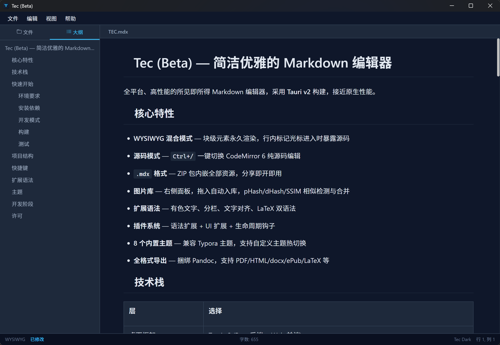

| &lt;img src="https://trae-api-cn.mchost.guru/api/ide/v1/text_to_image?prompt=modern%20minimal%20T%20letter%20logo%20for%20Markdown%20editor%20dark%20mode&amp;image_size=square" width="128" height="128"&gt; | Tec (Beta) |
| --- | --- |
| **全平台、高性能的 Typora 风格 Markdown 编辑器，采用 Tauri v2 构建，接近原生性能。** | |
| | [](https://opensource.org/licenses/MIT) [](https://tauri.app) [](https://react.dev) [](https://www.typescriptlang.org) |

</div&gt;

## 🌟 核心特性

- **WYSIWYG 混合模式** — 块级元素永久渲染，行内标记光标进入时暴露源码
- **源码模式** — `Ctrl+/` 一键切换 CodeMirror 6 纯源码编辑
- **`.mdx` 格式** — ZIP 包内嵌全部资源，分享即开即用
- **图片库** — 右侧面板，拖入自动入库，pHash/dHash/SSIM 相似检测与合并
- **扩展语法** — 有色文字、分栏、文字对齐、LaTeX 双语法
- **插件系统** — 语法扩展 + UI 扩展 + 生命周期钩子
- **8 个内置主题** — 兼容 Typora 主题，支持自定义主题热切换
- **全格式导出** — 捆绑 Pandoc，支持 PDF/HTML/docx/ePub/LaTeX 等

## 📁 .mdx 格式

**Tec 的核心创新格式**，ZIP 打包，内嵌全部资源，分享即开即用。

### 内部结构

```
document.mdx (ZIP, Store 压缩)
├── content.md              # 正文（图片引用指向 assets/）
├── assets/
│   ├── a1b2c3d4.webp        # hash 命名的图片
│   ├── e5f6g7h8.webp
│   └── manifest.json        # 图片元数据（相似分组、修改时间等）
├── theme.json               # 当前主题引用
├── color_map.json           # 颜色映射表
└── meta.json                # 文档元数据（版本、时间、语法扩展等）
```

### 性能特点

- **不解压到磁盘**：打开时只读取 ZIP 索引，按需解压到内存
- **增量修改**：保存时只替换变化的 entry，不重写整个 ZIP
- **图片流式解码**：只在进入视口时才读取并解码
- **原子写入**：先写 `.tmp` 文件，成功后再替换原文件

### .md ↔ .mdx 转换

| 方向 | 流程 |
|------|------|
| **md → mdx** | 扫描图片引用 → 本地图片复制/hash/压缩入库 → 网络图片可选下载 → 替换引用路径 → ZIP 打包 |
| **mdx → md** | 提取 content.md → 图片引用还原为原始路径 → 保存为纯 .md |

## 🛠️ 技术栈

| 层 | 选择 |
|----|------|
| 桌面框架 | Tauri v2 (Rust 后端 + Web 前端) |
| 前端 | React 19 + TypeScript + Vite 8 |
| 编辑器引擎 | Milkdown 7 (基于 ProseMirror) |
| 源码模式 | CodeMirror 6 |
| 状态管理 | Zustand |
| LaTeX | KaTeX |
| 代码高亮 | Shiki |
| 图片处理 | Rust image crate (dHash/pHash/SSIM + WebP) |
| 测试 | Vitest + Playwright + cargo test |

## 📖 扩展语法

### 有色文字

```
语法: &amp;X文本内容&amp;X

颜色映射表 (在 .mdx 的 color_map.json 中，用户可自定义):
  R=#E74C3C (红)    G=#2ECC71 (绿)    B=#3498DB (蓝)
  O=#E67E22 (橙)    P=#9B59B6 (紫)    Y=#F1C40F (黄)
  C=#1ABC9C (青)    K=#2C3E50 (黑)    W=#95A5A6 (灰)
  H=#E91E63 (粉/Highlight)

也可以直接用 #RRGGBB: &amp;#FF0000红色文字&amp;#FF0000
```

### 分栏

```
模式1: 自动均分
||2
内容会自动按段落均分到 2 栏。
|||

模式2: 手动指定
||3
第一栏内容...
|| 第二栏内容...
|| 第三栏内容...
|||

模式3: 打印流动（屏幕预览时按均分显示，打印时优先占满每页左栏）
||2:print
很长很长的内容...
|||
```

### 文字对齐

```
=== 居中的文字 ===
&gt;&gt;&gt; 右对齐的文字 &gt;&gt;&gt;
&lt;&lt;&lt; 左对齐的文字 &lt;&lt;&lt;

块级示例:
=== ## 居中标题 ===
&gt;&gt;&gt; 署名：Tec团队 &gt;&gt;&gt;
```

### LaTeX 公式

```
$$ 块级公式 $$     （标准语法）
/()/ 块级公式 /()/ （替代语法）
$ 行内公式 $       （行内）
/( 行内公式 /)     （行内替代）
```

### 其他扩展语法

| 语法 | 示例 |
|------|------|
| 高亮 | `==高亮文字==` |
| 上标 | `^上标^` |
| 下标 | `~下标~` |
| 脚注 | `[^1]` 引用 + `[^1]: 定义` |
| 表情 | `:smile:` |
| 目录 | `[TOC]` |
| 任务列表 | `- [ ] 任务项` |

## 🎨 主题

内置 8 个主题，热切换即时生效：

| 主题 | 类型 |
|------|------|
| Tec Light | 浅色 (品牌默认) |
| Tec Dark | 深色 (品牌) |
| GitHub | 浅色 |
| Newsprint | 浅色 |
| Night | 深色 |
| Pixyll | 浅色 |
| Whitey | 浅色 |
| Gothic | 深色 |

自定义主题放在 `~/.tec/themes/` 目录下即可在设置中选择。

## ⌨️ 快捷键

| 快捷键 | 功能 |
|--------|------|
| `Ctrl+S` | 保存文件 |
| `Ctrl+O` | 打开文件 |
| `Ctrl+N` | 新建文档 |
| `Ctrl+/` | 切换源码/WYSIWYG 模式 |
| `Ctrl+F` | 搜索替换 |
| `Ctrl+Shift+1` | 文件面板 |
| `Ctrl+Shift+2` | 大纲面板 |
| `Ctrl+Shift+L` | 切换侧边栏 |

## 📂 项目结构

```
Tec/
├── src/                       # 前端源码
│   ├── components/
│   │   ├── editor/            # 编辑器 (WYSIWYG + 源码模式 + 搜索替换)
│   │   ├── sidebar/           # 左侧面板 (文件树 + 大纲)
│   │   ├── gallery/           # 右侧图片库面板
│   │   ├── menubar/           # 顶部菜单栏
│   │   ├── statusbar/         # 底部状态栏
│   │   └── theme/             # 主题选择器
│   ├── extensions/            # Milkdown 自定义扩展 (11个)
│   ├── hooks/                 # React Hooks (文件操作/图片操作/自动保存)
│   ├── store/                 # Zustand 状态管理
│   ├── styles/
│   │   ├── themes/            # 8 个内置主题 CSS
│   │   ├── variables.css      # CSS 变量主题引擎
│   │   ├── layout.css         # 布局样式
│   │   └── editor-theme.css   # 编辑器渲染样式
│   ├── types/                 # TypeScript 类型定义
│   └── __tests__/             # 前端单元测试
├── src-tauri/                 # Rust 后端
│   └── src/
│       ├── commands/          # Tauri Commands (文件/MDX/导出)
│       ├── image/             # 图片处理 (哈希/压缩/SSIM/相似检测)
│       └── error.rs           # 统一错误类型
├── DESIGN.md                  # 完整设计文档
└── package.json
```

## 🚀 快速开始

### 环境要求

- **Node.js** &gt;= 20
- **Rust** &gt;= 1.77 (stable-x86_64-pc-windows-msvc)
- **Visual Studio Build Tools** (Windows，含 C++ 工作负载)

### 安装依赖

```bash
npm install
```

### 开发模式

```bash
# 仅启动前端开发服务器
npm run dev

# 启动完整 Tauri 应用（含 Rust 后端）
npx tauri dev
```

### 构建

```bash
# 前端构建
npm run build

# 完整 Tauri 打包（Windows/macOS/Linux）
npx tauri build
```

### 测试

```bash
# 前端单元测试
npm test

# Rust 端单元测试
cd src-tauri &amp;&amp; cargo test
```

## 📊 Star History

[](https://star-history.com/#e2662020/Tec&amp;Date)

## 👥 Contributors

感谢所有为 Tec 做出贡献的人！

[](https://github.com/e2662020/Tec/graphs/contributors)

## 📄 许可证

MIT License © 2024

